# PowerTabletManual
---
## Other languages
* [한국어](https://github.com/Lumy0726/PowerTabletManual/blob/main/README_kr.md/)
---
  

# What is PowerTablet  
You can use your android device as tablet or touchpad, in Windows PC. PowerTablet supports various connection methods: WIFI, USB accessory, ADB. PowerTablet is optimized for low-latency. If your android deivce supports stylus pen which has hovering feature, you can use hovering like tablet. PowerTablet also supports keyboard too.  
PowerTablet do not require Windows's device driver, instead PowerTablet use some Windows API to send mouse/keyboard events. To put it simply, PowerTablet tells Windows directly about mouse position/movement/click and keyboard click, rather sends real hardware signal. This is similar with most of keyboard macro programs. Due to this operation, PowerTablet mights be faster than driver-based method, mights be unstable a little if your PC is too busy therefore has no time to execute PowerTablet, and mights have compatibility issues for some environments (like UAC control windows or anti-cheat program).

---
# Download Program
For using PowerTablet, both android PowerTablet program and Windows PC PowerTablet program are required.  
You can download android PowerTablet at Google Playstore.  
[https://play.google.com/store/apps/details?id=kr.co.lumylumy.pc_communication](https://play.google.com/store/apps/details?id=kr.co.lumylumy.pc_communication)  
You can download Windows PS PowerTablet at this google drive link.  
[https://drive.google.com/file/d/1VRRphWr5K8hKJbQoM01fVsAIylQd23Bn/view?usp=sharing](https://drive.google.com/file/d/1VRRphWr5K8hKJbQoM01fVsAIylQd23Bn/view?usp=sharing)  
You don't need to install Windows PC PowerTablet, just un-zip the zip file and executing PowerTablet.exe file in that is enough.  
The zip file consist of three files like this.  
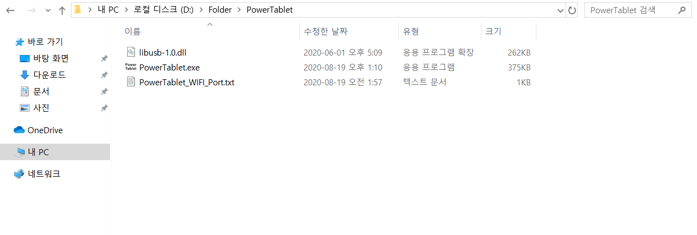  

---
# Setting up connection
You can connect PowerTablet to your PC using three methods: WIFI, USB, and ADB(USB).  
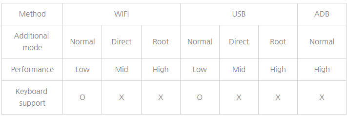  
Latency is smaller in root, direct, normal order in each mode. And latency is smaller at USB method then WIFI method.  
Especially, you can use full input refresh rate of your device at root mode or ADB method, whose performance is high. If you want high performance without rooted device, use ADB method. But latency is smaller at root mode with USB method then ADB method.  
USB method is more stable and faster than WIFI method but it is complicated since installing driver manually is required.  
Therefore WIFI method is recommended if you don't need low latency.  
If your WIFI environment is fast enough, latency difference between USB method will be quite small.  
In this manual, WIFI method and ADB method will be explained.  
Manual of connecting USB method is in below link.  
[https://github.com/Lumy0726/PowerTabletManual/blob/main/USB_manual.md/](https://github.com/Lumy0726/PowerTabletManual/blob/main/USB_manual.md/)

## \<Setting up connection with WIFI method\>
* Connect PC and android device using same WIFI, or setup hotspot at one side.
* If you want, you can change port number by editing 'PowerTablet_WIFI_Port.txt' file.
* Run PowerTablet.exe and press 'W' key on the first menu.
* Remember IP address and Port number (This IP address is usually your local IP of WIFI).  
  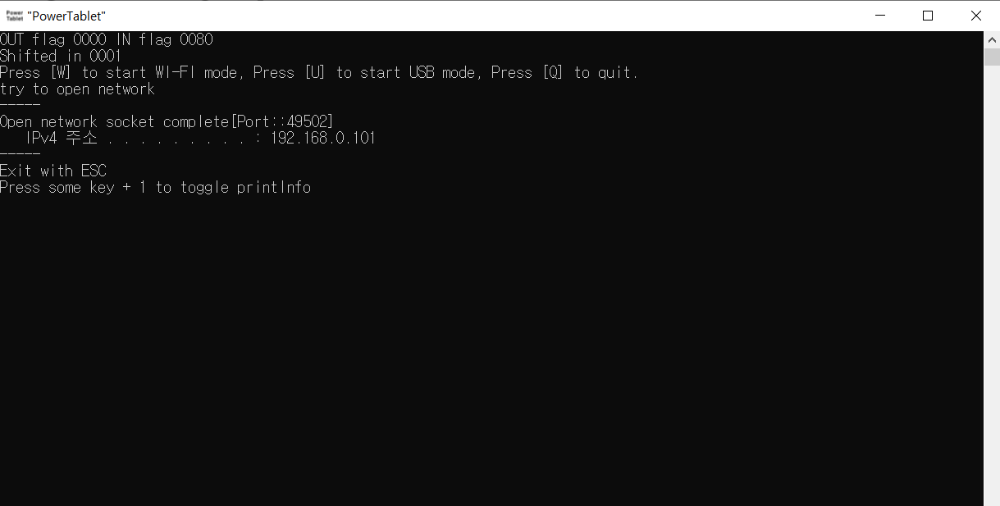  
  In this case, you can connect to PC by using 192.168.0.101:49502 address. If program shows multiple addresses, you have to use WIFI address. Note that WIFI address usually start with 192.168 and so on. You can also check IP address manually at Windows CMD program by 'ipconfig' command.
* Run android PowerTablet, Press WIFI button, type IP address and port number, press 'Connect' button.  
  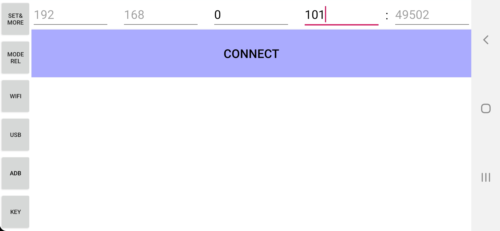  
  Then android PowerTablet displays ON at WIFI button.  
    
  PC program displays like this.  
  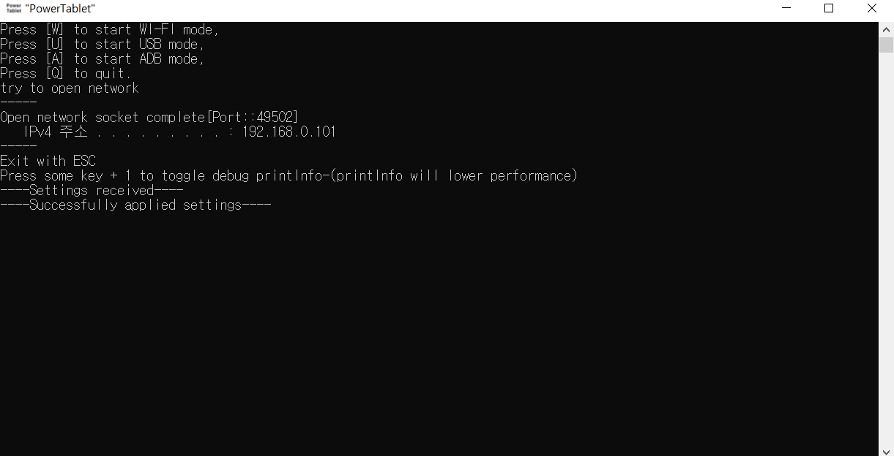  
  The connection is completed when PC program says 'Successfully applied settings'.  
  **If connection fails, check IP address and port number again, check whether PC's firewall is blocking network of PowerTablet.**  
  PowerTablet use one-way communication for low latency, so even if connection fails, android PowerTablet says connection on and send data to wrong IP address. **Therefore you should check whether connection is completed at PC side.**  
  **If your PC uses public IP directly, or uses public WIFI to which anyone can access, using PowerTablet WIFI method is not recommended.** In this case, anyone can access to your PC using PowerTablet. You can configure firewall manually if you need.

## \<Setting up connection with ADB method\>
* Install default USB driver depends on your device. This is not required in most cases.
* Install ADB program. Go to below link, and click 'Download SDK Platform-Tools for Windows', download it.  
  [https://developer.android.com/studio/releases/platform-tools](https://developer.android.com/studio/releases/platform-tools)  
  Unzip the file anywhere you want. The unziped files look like this.  
  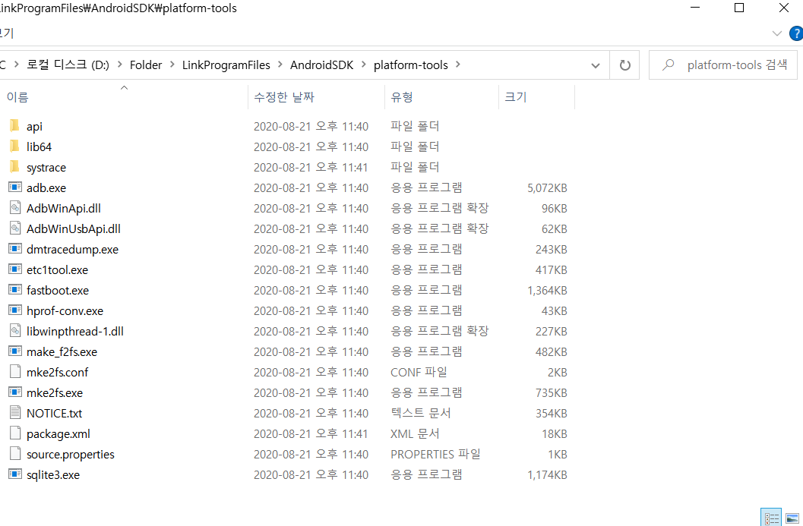  
  Register this directory to system's environment path, like this.  
  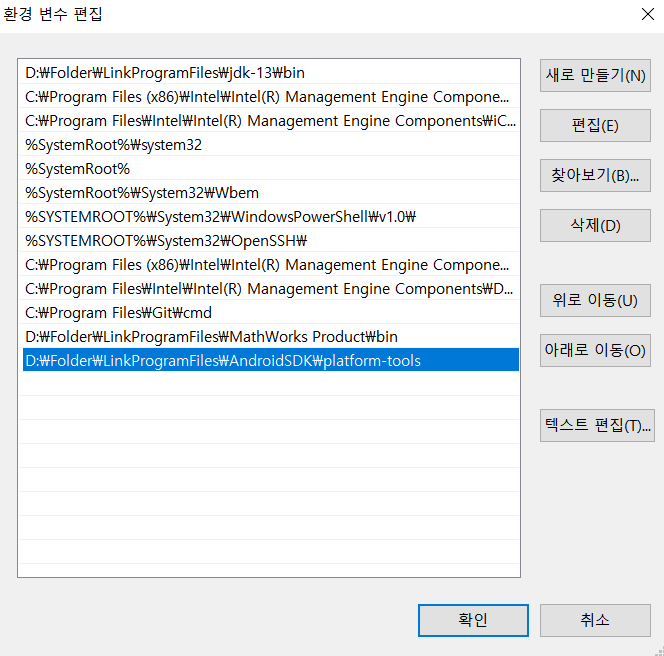  
  You can access this panel like this:  
  Control Panel -> All Control Panel Items -> System Info -> Advanced system settings -> Advanced -> Environment Variables -> System variables -> Select 'Path' -> Select 'Edit'.  
  If you do not want this, or cannot do this, just put PowerTablet.exe and other files like libusb-1.0.dll to ADB directory and run PowerTablet.exe is enough.
* Turn on 'USB debugging' option in android device. You can enable 'Developer options' by clicking (Settings -> About phone -> Software information -> build number) more than 7 times. Then you can enable 'USB debugging' in 'Developer options'.
* Connect your android device to PC using USB, run PowerTablet.exe, press 'A' key on the first menu. You may have to give privilege to android, if pop-up is appeared on android. If PC PowerTablet says 'Setup ADB complete' like this, ADB connection works well (but not fully completed).  
  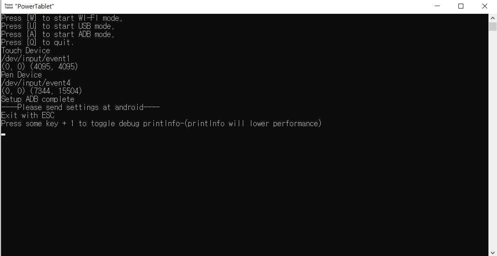
* Press 'ADB' button of android PowerTablet program. Note that you should do this step after ADB connection works well at PC side.  
  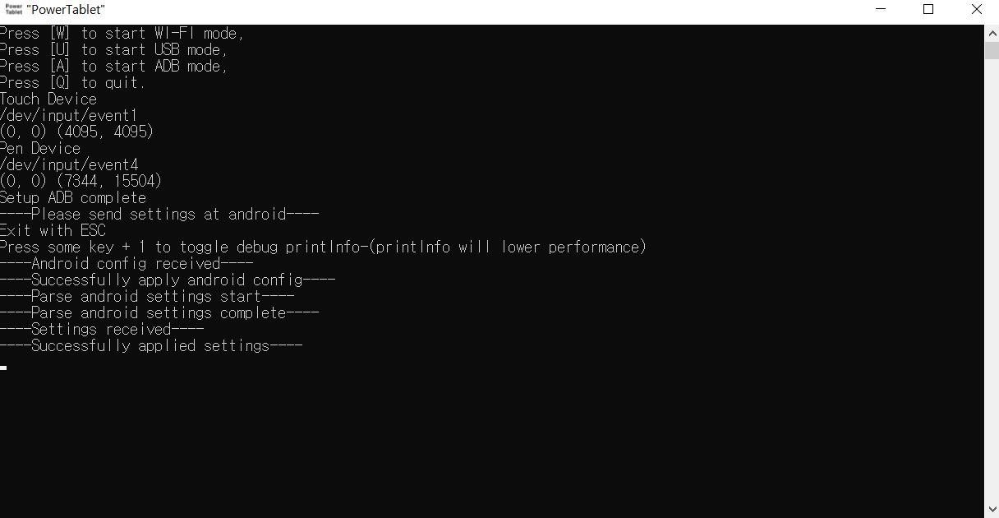  
  If PC PowerTablet says 'Successfully applied settings', connection is fully completed. Please check whether connection is completed at PC program, since PowerTablet has no way to check connection at android side.
* \<Manually selecting ADB input device\>  
  If PowerTablet cannot recognize proper input devices of your android, try this way. Press 'S' key instead 'A' key of PC PowerTablet.  
  In this way, you can select input device number manually. If you press 'S' key and press any key, you can see your android input devices like this.  
  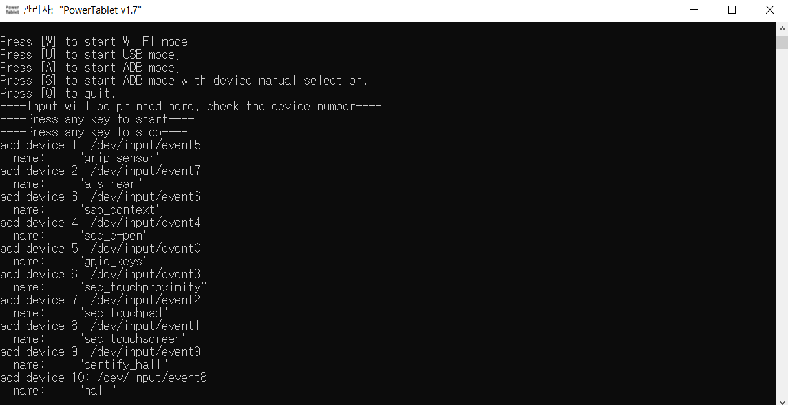  
  There are list of your input devices, '/dev/input/eventX', the 'X' is the number of that device (NOT the number of left!). If you touch your android device in this state, PowerTablet will print the input data like this.  
  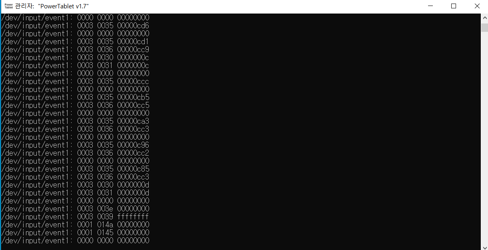  
  You can see input devices and some value of your input data. So you can determine what is touch or pen input device. Press any key to stop this, and type the number of input device like this.  
  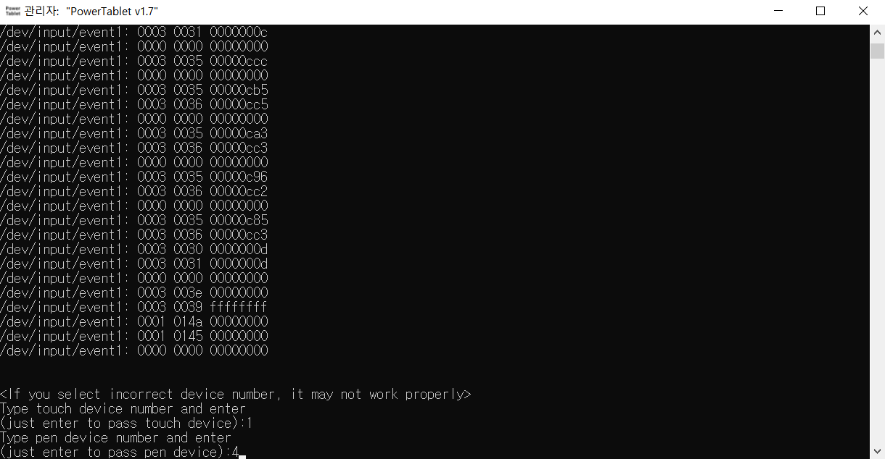  
  In this case, touch device number is 1 and stylus pen device number is 4. You can just enter to skip one of the device. Note that using incorrect devices may not work properly. Especially, changing the number of touch device and input device will not work. If PC PowerTablet says 'Setup ADB complete' like this, ADB connection works well (but not fully completed).  

---
# Overall interface
PowerTablet main interface looks like this.  

* The upper-left light gray region is mouse left button click.
* The lower-left dark gray region is mouse right button click.
* The upper-right light gray region is right button click.
* The mid-right dark gray region is mouse wheel.
* The lower-right light gray region is mouse wheel(center) button.
* The main region in center is called 'Tablet Region', used for tablet or touchpad.

* If you press 'SET&MORE' button, interface looks like this.  
  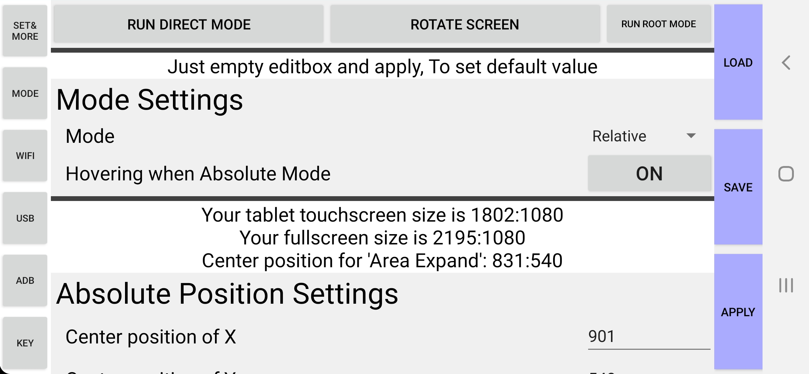  
  In this menu, you can manage settings, rotate screen, or run additional mode.
* 'MODE' button at left side is working when PowerTablet is connected with PC. It displays current mode(Absolute or relative), also you can change mode with this button.
* 'WIFI' button is used for WIFI connection method, this can open WIFI IP setting interface, close WIFI IP setting interface, close WIFI connection when connection is on.
* 'USB' button is used for USB connection method, connecting or disconnecting.
* 'ADB' button is used for ADB connection method, connecting or disconnecting.
* 'KEY' button is used for displaying keyboard, like this.  
  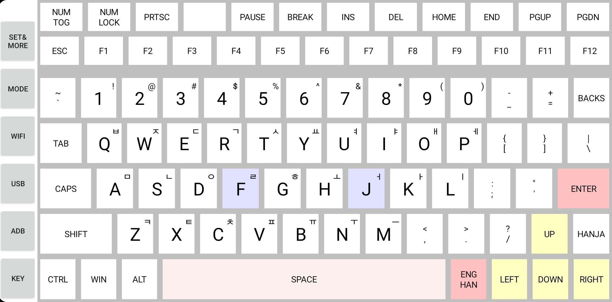  
  It uses custom layout keyboard instead of android's keyboard, to simulate PC keyboard and send key input directly to PC.  
  CTRL, SHIFT, ALT key is toggle-key, and you can display numberpad using 'NUM TOG' button at upper-left.  
  Note that this keyboard is designed for english/korean layout, so some special key may be incompatible. This might be updated with more layout with later version of PowerTablet.

---
# Settings and using
Settings interface looks like this.  
  
You can load and save settings in your android device using 'LOAD' and 'SAVE' button. If settings are already existed, PowerTablet load settings automatically when you open settings or connect to PC.  
If you press 'APPLY' button, this will send settings PC and close settings interface.  
> Also this button can display absolute mode input region, regardless of whether PC is connected or not, like this.  
>   
> (The region includes line too)  
> Also this button can be used for recover specific settings to default value, regardless of whether PC is connected or not. If editboxs of settings are empty, it will be recovered.

You can run direct input mode or root mode using corresponding buttons.  
You can rotate screen using corresponding button.

## \<Absolute mode\>
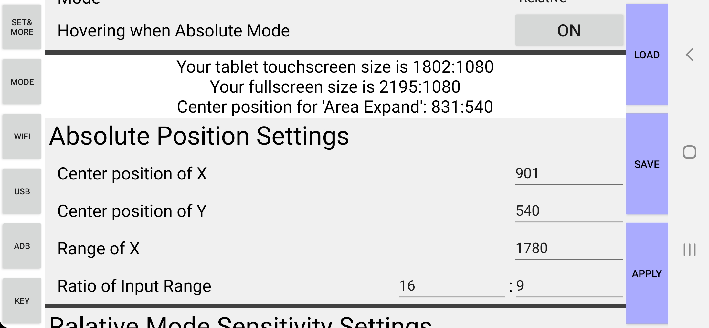  

You can set absolute mode input region at 'Absolute Position Settings'. There are center position of X, center position of Y, range of X, ratio of input range. It is recommended to set ratio of input range to your PC display ratio. If you put negative number in 'Range of X', input position will be reversed. If you put negative number in ONE of the 'Ratio of Input Range', input position of Y-axis will be reversed.  
In absolute mode, you cannot use gesture.  
If "Hovering when Absolute Mode" is off, 'Tablet Region' do not support mouse click, so you have to use upper-left light gray region.  
If "Hovering when Absolute Mode" is on, it works like normal tablet. Hovering will move mouse, touch will click and move mouse. But you can use hovering only when your android device support it by stylus pen.

## \<Relative mode (like touchpad)\>
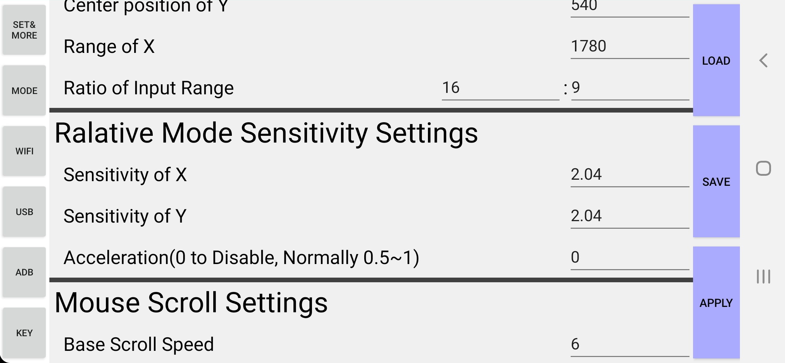  

You can set relative mode sensitivity at 'Relative Mode Sensitivity Settings'. And you can set gesture settings at "Relative Mode Gesture Settings" (Will be explained later).  
There are sensitivity of X, sensitivity of Y, acceleration. If you put same number at X and Y sensitivity, the moving ratio of X-axis and Y-axis are same regardless of PC display ratio. If you set acceleration to 0, it will disable acceleration. If you set acceleration over 0, the mouse movement will much faster by how much your touch movement is fast. If you want set acceleration, then 0.5~1 value is recommended.  
And please note that, in relative mode, final sensitivity is affected by Windows PC mouse sensitivity and acceleration.

## \<Mouse Scroll\>
PowerTablet uses special mouse scroll method.  
  
Mid-right dark gray button is scroll button. You can scroll by moving touch upper or lower. And if you move finger (your touch position) to left (to 'Tablet Region'), scroll speed will be faster by how much you move to left, you can scroll in this state. So you can use slow scroll speed to default, and fast scroll to drag left.  
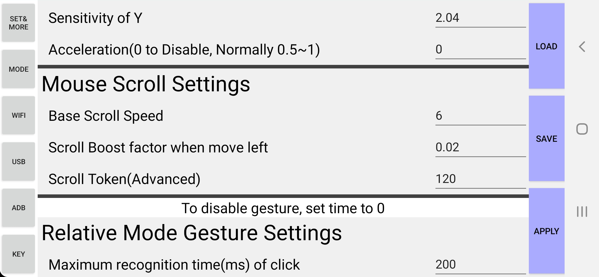  
At 'Mouse Scroll Settings', you can set base scroll speed, scroll boost factor when move left, and scroll token.  
You can set minimum scroll quota at 'Scroll Token', which is advanced settings. Changing this is usually not recommended. Some program do scroll using "How many time I get scroll message", rather scroll value. So, changing scroll token will change scroll speed of these program.

## \<Relative mode gesture\>
PowerTablet supports three normal gesture.  
First is mouse left click using short tap.  
Second is mouse double click using short double tap.  
The last one is mouse left click and moving, using short tap and dragging.  
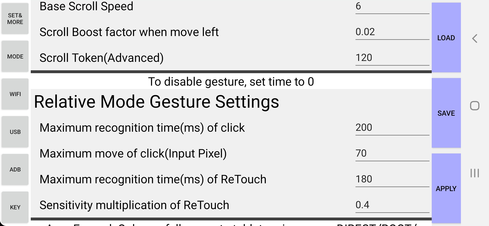  
You can set maximum recognition time and maximum move of click, of these gestures. This means that if you touch and touch-out 'Tablet Region' within recognition time without moving more than maximum move pixel, that will be one 'tap' of gesture. If you set time to 0, this will disable gestures.  
And, PowerTablet also supports special gesture. You can change sensitivity temporally when you touch-up and touch-down in short time while dragging. In generally, you can use this gesture to delicately move mouse cursor, when mouse acceleration is disabled. I will call this to ReTouch gesture. You can set maximum recognition time and ReTouch Sensitivity multiplication. Set time to 0 to disable ReTouch gesture.

## \<Area Expand\>
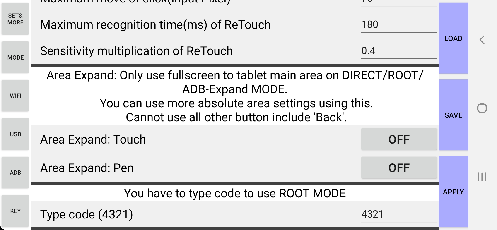  

Area Expand feature helps to use more large area in absolute mode.
  
In generally, the input area of absolute mode is in the 'Tablet Region' (rectangle line of picture). But actually you can set input area outside of 'Tablet Region' at 'Absolute Position Settings'. In this case, normally you cannot use input region which is in outside of 'Tablet Region'. But you can touch that region if you set 'Area Expand', by ignoring other buttons like mouse button region or 'WIFI' 'USB' buttons.  
You can ONLY use 'Area Expand' in Direct mode, Root mode, and ADB-Expand mode. And you cannot use buttons and other region by input type which you set to 'Area Expand'. Note that if you want press 'Back' button when 'Area Expand' is on, you can use back button of your android device.  
The ADB-Expand mode can be run by pressing 'RUN ADB-EXPAND MODE', which is appeared at 'RUN DIRECT MODE' button when you use ADB method.

---
# Additional WARNING
* **If your PC uses public IP directly, or uses public WIFI to which anyone can access, using Powertablet WIFI method is not generally recommended. In this case, anyone can access to your PC using Powertablet.** Recommend to configure firewall manually (only accept your android device's IP address of PowerTablet's port number) in such case.
* **PowerTablet does not have encryption, regardless of connection method. It is possible that other people can figure out your keyboard and mouse data generated by PowerTablet, if one hack your PC. Therefore do not type important personal data using PowerTablet.**
* PC program of PowerTablet does not require administrator privilege. But if another program runs in administrator privilege, you cannot use PowerTablet in that program. In this case, you can run PowerTablet in administrator privilege. Also, PowerTablet doesn't work in UAC control window generally (the pop-up window that require administrator privilege).
* If PowerTablet is disconnected while you press some keyboard of mouse click, state of the key remain pressed (because PowerTablet doesn't send key out event). In this case, you can just press that key again to solve it.
* Android PowerTablet does not guarantee the application keep running in some situation. like incomming call. This mean PowerTablet can be interrupted while using it.
