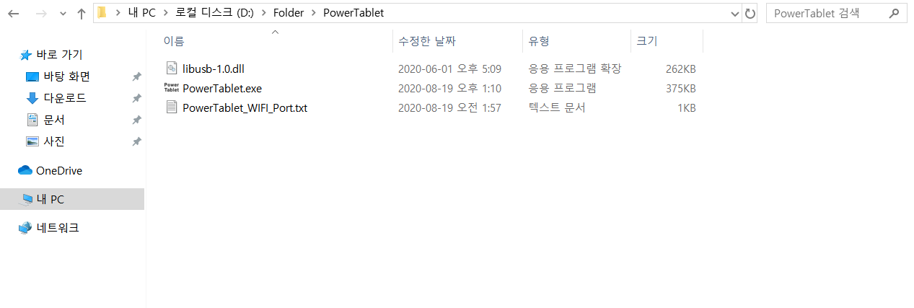
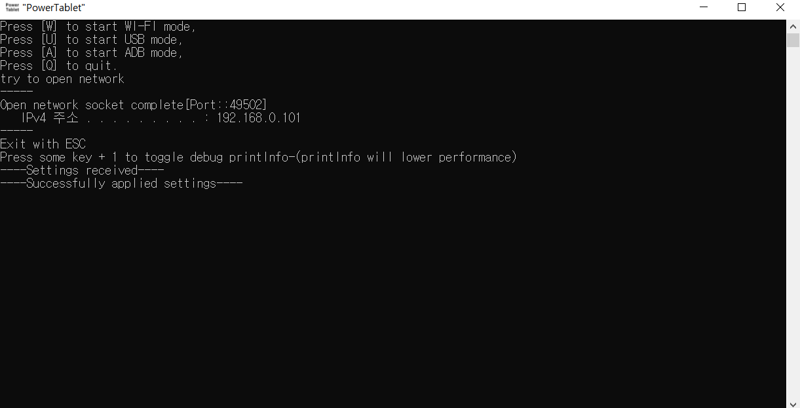
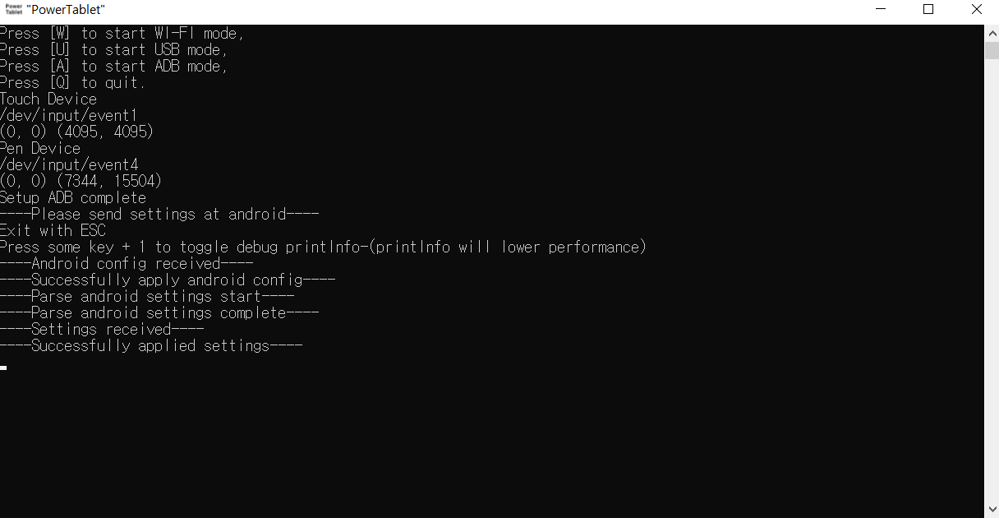
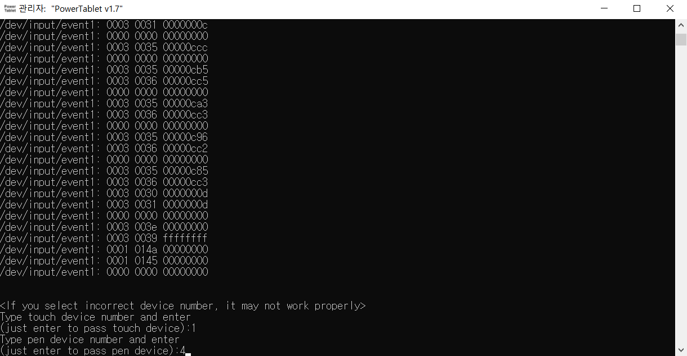

# PowerTabletManual
---
## Other languages
* [english](https://github.com/Lumy0726/PowerTabletManual/blob/main/README.md/)
---
  

# PowerTablet이 무엇인가요  
PowerTablet을 이용하면 안드로이드 폰을 Windows PC와 연결하여 타블렛 혹은 터치패드로 사용할 수 있습니다. WIFI와 USB accessory 그리고 ADB의 연결방식을 지원하며, 적은 레이턴시를 위해 최적화되었습니다. 안드로이드 기기가 호버링을 지원하는 펜이 있는 경우, 일반적인 타블렛처럼 호버링을 사용할 수 있습니다. 가상 키보드 또한 지원합니다.  
PowerTablet은 Windows 운영체제의 디바이스 드라이버를 사용하는 대신에 Windows API를 사용해서 마우스와 키보드 이벤트를 보냅니다. 간단히 말해서 PowerTablet은 실제 하드웨어 신호를 보내는 대신에 마우스의 위치/이동/클릭과 키보드 입력을 윈도우에게 직접 말해줍니다. 이러한 방식은 대부분의 키보드 매크로 프로그램과 유사합니다. 이러한 동작 방식으로 인하여, PowerTablet은 경우에 따라서 드라이버 기반의 방식보다 빠를 수도 있으며, PC가 너무 바빠서 PowerTablet을 실행할 시간이 없다면 조금 불안정할 수도 있으며, 몇몇 환경에서의 호환성 문제가 있을 수도 있습니다 (UAC 창이나 안티 치트 프로그램 등).

---
# Download Program
PowerTablet을 사용하시려면 안드로이드용 프로그램과 Windows PC용 프로그램이 필요합니다.  
안드로이드용 프로그램은 구글 플레이 스토어에서 받으실 수 있습니다.  
[https://play.google.com/store/apps/details?id=kr.co.lumylumy.pc_communication](https://play.google.com/store/apps/details?id=kr.co.lumylumy.pc_communication)  
Windows PC용 프로그램은 아래 구글 드라이브 링크에서 받으실 수 있습니다.  
[https://drive.google.com/file/d/1VRRphWr5K8hKJbQoM01fVsAIylQd23Bn/view?usp=sharing](https://drive.google.com/file/d/1VRRphWr5K8hKJbQoM01fVsAIylQd23Bn/view?usp=sharing)  
Windows PC용 프로그램은 설치하실 필요는 없으며, 압축파일을 풀어서 나오는 파일을 실행하는 것으로 충분합니다.  
압축된 파일은 3개로, 다음과 같습니다.  
  

---
# PC와 연결하기
PC와 연결하는 방법은 WIFI와 USB와 ADB(USB) 세가지 방식이 있습니다.  
  
각 모드에서 루트, 직접입력, 일반 순으로 지연이 적으며, WIFI보다는 USB가 지연이 적습니다.  
특히 성능이 '상'인 루트 모드와 ADB 연결방식은 기기의 최대 보고율을 사용할 수 있는 방법입니다. '루트'모드는 루팅된 기기에서만 사용할 수 있으므로 루팅 없이 최고의 성능을 원한다면 ADB연결방식을 사용하기 바랍니다. 그렇지만 ADB 연결방식보다 USB연결의 루트 모드가 더 적은 지연시간을 가집니다.  
USB 방식은 WIFI보다 빠르고 안정적이지만 관련 드라이버를 직접 설치하여야 하므로 조금 복잡합니다.  
특별한 경우를 제외하고는 WIFI연결을 권장합니다.  
WIFI 환경이 충분히 빠르다면, USB와의 지연시간 차이는 그리 크지 않습니다.  
이 글에서는 WIFI와 ADB(USB)만 설명하도록 하겠습니다. USB로 연결하는 방법은 다음 글을 참고하시기 바랍니다.  
[https://github.com/Lumy0726/PowerTabletManual/blob/main/USB_manual_kr.md/](https://github.com/Lumy0726/PowerTabletManual/blob/main/USB_manual_kr.md/)

## \<WIFI를 이용해서 연결하기\>
* PC와 안드로이드를 같은 WIFI환경에 둡니다. (둘 다 같은 WIFI에 연결하거나, 혹은 한쪽이 핫스팟을 구성합니다).
* 필요하다면, PowerTablet_WIFI_Port.txt 파일을 열어 포트번호를 편집할 수 있습니다.
* PC프로그램 PowerTablet.exe를 실행시키고 처음 나오는 메뉴에서 w키를 누릅니다.
* PC프로그램에서 나오는 IP와 포트 번호를 확인합니다. (이 IP는 보통 WIFI 안에서만 사용되는 local IP입니다).  
    
  위 경우에는 192.168.0.101:49502 로 연결할 수 있습니다. 만약 IP가 여러개 뜬다면, WIFI연결의 IP를 사용하여야 합니다. 보통 WIFI 주소는 192.168로 시작하므로 참고하기 바랍니다. 또한 컴퓨터에 있는 명령 프롬프트(CMD)를 실행한 뒤 ipconfig를 쳐서 IP를 직접 확인할 수 있습니다.
* 안드로이드 PowerTablet 프로그램을 실행시킨 뒤, WIFI버튼을 눌러 나오는 메뉴에서 IP와 포트번호를 입력 후 확인(연결)을 누릅니다.  
    
  그 후 안드로이드 프로그램은 다음과 같이 WIFI버튼에 ON이 표시되고,  
    
  PC 프로그램은 다음과 같이 표시됩니다.  
    
  다음과 같이 Successfully applied settings라는 문구가 뜨면 연결이 완료된 것입니다.  
  **만약 연결이 되지 않는다면 IP를 한번더 확인하고, PC의 방화벽이 PowerTablet프로그램을 막고 있는 것은 아닌지 점검하기 바랍니다.**  
  빠른 통신을 위하여 단방향 통신 (안드로이드 -> PC) 를 사용하므로, 잘못된 IP입력 등으로 연결에 실패하여도 안드로이드에서는 연결에 성공하였다고 뜨며 해당 IP로 계속 정보를 보내게 됩니다. **따라서 PC프로그램에서 연결이 완료되었는지 꼭 확인하기 바랍니다.**  
  **PC가 공인 아이피를 사용중이거나, 불특정 다수에게 공개된 WIFI를 사용하는 환경에서 프로그램을 사용하지 않는 것을 권장합니다.** 해당 경우에는 전세계 누구나 혹은 해당 WIFI에 있는 누구나 당신의 PowerTablet에 접근할 수 있는 환경을 만들어줄 것입니다. 필요하다면 방화벽을 직접 구성하여 사용할 수도 있습니다.

## \<ADB를 이용해서 연결하기\>
* 본인의 안드로이드 기기에 맞는 USB드라이버를 설치합니다. 대부분 기본적으로 설치되어 있으므로 필요하지 않습니다.
* ADB를 설치합니다. 다음 사이트에 들어가서 Windows 용 SDK 플랫폼 도구 다운로드를 클릭하여 다운받습니다.  
  [https://developer.android.com/studio/releases/platform-tools](https://developer.android.com/studio/releases/platform-tools)  
  다운받은 파일의 압축을 원하는 아무 곳에나 풀어줍니다. 압축을 풀면 다음과 같은 파일들이 있을 것입니다.  
    
  위와 같이 '본인'의 ADB파일이 있는 경로를 아래와 같이 제어판에 환경변수에 등록합니다.  
    
  위 창은 제어판->모든 제어판 항목->시스템->고급 시스템 설정->환경 변수->시스템 변수에 'Path'를 선택하고 '편집'을 클릭하면 열 수 있습니다.  
  이 방식을 사용하고 싶지 않거나 잘 이해가 되지 않는다면 그냥 PowerTablet.exe 실행파일과 libusb-1.0.dll 등의 파일을 ADB가 있는 폴더에 넣고 실행하여도 됩니다.
* 안드로이드의 USB디버깅을 활성화합니다. 일반적으로 안드로이드의 설정->휴대전화 정보->소프트웨어 정보->'빌드 번호'를 7번 이상 클릭하면 개발자 옵션을 열 수 있으며, 그 옵션 안에서 USB디버깅을 켜주면 됩니다.
* 안드로이드 기기를 PC에 연결한 뒤, PowerTablet.exe를 실행시키고 처음 나오는 메뉴에서 A키를 누릅니다. 안드로이드에서 연결 승인 창이 나오면 확인을 눌러줍니다. 다음과 같이 안드로이드의 디바이스 정보가 나오면서 'Setup ADB complete'가 나오면 ADB 연결이 잘 작동하는 것입니다 (하지만 완전히 연결된 것은 아닙니다).  
  
* 이후 안드로이드의 PowerTablet에서 'ADB'버튼을 클릭합니다. PC에서 ADB 연결을 먼저 한 뒤에 해야 정상적으로 연결됩니다.  
    
  이후 PC에서 'Successfully applied settings'가 떠야 연결이 완전히 완료된 것입니다. 앱 특성상 안드로이드에서 연결을 확인할 수 있는 방법이 없으므로 PC에서 연결이 완료되었는지 확인하기 바랍니다.
* \<ADB 입력 장비 번호를 직접 선택하기\>  
  PowerTablet이 입력 장비를 인식하지 못한다면, 이 방식을 시도할 수 있습니다. A키 대신 S키를 누르면 입력 장비 번호를 직접 선택할 수 있습니다.  
  S키를 누른 뒤에 키보드의 아무 키나 누르면, 다음과 같이 연결한 안드로이드 기기의 입력 장비를 볼 수 있습니다.  
    
  '/dev/input/eventX'와 같이 입력 장비의 목록이 표시됩니다. 여기서 X가 입력 장비 번호입니다 (왼쪽에 있는 번호가 아닙니다!). 여기서 안드로이드 기기를 터치하면 다음과 같이 입력 정보가 표시됩니다.  
    
  따라서 여기에서 입력 장비 번호와 입력 데이터를 보고 터치 장비와 펜 장비의 번호를 알아낼 수 있습니다. 키보드의 아무 키나 눌러서 중지한 뒤, 다음과 같이 입력 장비 번호를 입력하면 됩니다.  
    
  이 경우에는 터치 장비 번호가 1, 펜 입력 장비 번호가 4입니다. 'touch device):' 뒤에 터치 입력 장비 번호를, 'pen device):' 뒤에 펜 입력 장비 번호를 차례대로 입력하면 됩니다. 그냥 엔터를 눌러서 장비 중 하나를 생략할 수 있습니다. 잘못된 장비 번호를 입력하면 정상적으로 동작하지 않을 수도 있습니다. 특히, 터치 장비 번호와 펜 입력 장비 번호를 바꾸면 동작하지 않습니다. A키를 눌렀을 때와 같이 'Setup ADB complete'가 나오면 ADB 연결이 잘 작동하는 것입니다 (하지만 완전히 연결된 것은 아닙니다).  

---
# PowerTablet 화면 구성
PowerTablet의 메인 창은 다음과 같습니다.  

* 좌측상단의 밝은 회색 칸은 마우스 좌클릭입니다.
* 좌측하단의 어두운 회색 칸은 마우스 우클릭입니다.
* 우측상단의 밝은 회색 칸은 마우스 우클릭입니다.
* 우측중앙의 어두운 회색 칸은 마우스 휠 입니다.
* 우측하단의 밝은 회색 칸은 마우스 휠 버튼 입니다.
* 화면 중앙의 칸은 타블렛 및 터치패드로 활용되는 영역입니다. 타블렛 영역이라 칭하겠습니다.

* '설정'버튼을 누르면 다음과 같은 설정 창을 열 수 있습니다.  
    
  이 창에서는 설정을 관리하거나, 기기의 화면을 180도 회전시키거나, 직접/루트 모드를 실행할 수 있습니다.
* 왼쪽의 '모드'버튼은 PC와 연결되어 있을 때에 작동하며, 현재 모드를 표시하고, 버튼 클릭 시 현재 모드를 바꾸어주는 역할을 합니다.
* WIFI버튼은 WIFI연결 시 사용하며, WIFI설정창에서 누르면 설정창을 닫고, WIFI가 연결된 상태에서 누르면 연결을 해제합니다.
* USB버튼은 USB연결 및 연결해제 시 사용합니다.
* ADB버튼은 ADB연결 및 연결해제 시 사용합니다.
* KEY(키)버튼은 다음과 같은 키보드를 띄우고 내리는 버튼입니다.  
    
  PC의 키보드를 최대한 제현하고, 버튼을 누르는 즉시 키를 전송하기 위해 안드로이드의 키보드 대신 자체 키보드 레이아웃을 사용합니다.  
  CTRL, SHIFT, ALT는 토글 형식으로 동작하며, 제일 왼쪽 상단의 NUM TOG버튼을 통해 키보드에 넘버패드를 띄울 수도 있습니다.  
  이 키보드는 영어/한국어용 레이아웃이므로 몇몇 특수 키 등은 호환되지 않을 수 있습니다. 다른 추가 레이아웃은 PowerTablet의 추후 버전에 업데이트될 수도 있습니다.

---
# 설정과 사용법
설정 버튼을 누르면 다음과 같은 창을 볼 수 있습니다.  
  
우측의 저장(SAVE)버튼과 불러오기(LOAD)버튼을 통해 설정을 안드로이드에 저장하고 불러올 수 있습니다. 설정된 저장이 있는 경우에서 앱을 실행시킨 뒤 처음으로 설정을 열거나 처음으로 PC와 연결하는 경우 자동으로 설정을 불러오는 기능이 있습니다.  
적용(APPLY)버튼은 현재 설정을 PC로 전송하고 설정창을 닫습니다. PC와 연결되어 있지 않은 경우 설정을 전송하지 않습니다.  
> 또한 APPLY버튼을 누르면 PC 전송 유무와 관계없이 아래 사진처럼 화면에 절대입력 영역을 표시해줍니다.  
>   
> (경계선의 바깥쪽까지 입력 영역입니다)  
> 추가로 적용(APPLY)버튼은 특정 설정값을 기본값으로 복원하는데에도 사용할 수 있습니다. 설정칸을 빈칸으로 둔 상태에서 적용(APPLY)버튼을 누르면 기본값으로 변경할 수 있습니다.

직접입력 모드나 루트 모드를 해당하는 버튼을 통해 실행할 수 있습니다.
화면 회전 버튼을 통해 화면을 회전할 수 있습니다.

## \<절대위치 모드\>
  

절대위치 모드는 '절대입력 설정'에서 입력 영역을 설정하고 사용할 수 있습니다. 순서대로 입력 영역의 중앙 X좌표, 중앙 Y좌표, 입력 영역의 좌우 폭, 입력 영역의 비율을 설정할 수 있습니다. 비율을 컴퓨터 화면 비율과 동일하도록 설정하는 것이 일반적입니다. 좌우 폭을 음수로 설정하면 입력이 반전되며, 입력 영역 비율중 하나를 음수로 두면 입력의 상하만 반전됩니다.  
절대위치모드에서는 제스쳐를 지원하지 않으며, 모드 설정의 호버링이 켜져 있지 않은 경우는 타블렛 영역에서 마우스 클릭을 지원하지 않으므로 좌측 버튼 등을 활용하여야 합니다.  
호버링이 켜저 있는 경우에는 일반적인 타블렛처럼 호버링 입력이 마우스를 움직이며, 타블렛 영역을 직접 터치할 경우는 마우스 클릭과 함께 마우스를 움직일 수 있습니다. 안드로이드 단말이 호버링을 지원하는 전용 펜을 가지고 있는 경우에만 정상적으로 사용할 수 있습니다.

## \<상대위치 모드 (터치패드)\>
  

상대위치 모드는 '상대입력 설정'에서 입력 감도를 설정하고 '상대입력 제스쳐 설정'에서 몇몇 제스쳐의 설정을 해서 사용할 수 있습니다.  
'상대입력 설정'에서는 순서대로 X감도, Y감도, 터치패드 가속도를 설정할 수 있습니다. X감도와 Y감도를 동일하게 설정하면 PC의 화면 비율에 관계없이 상하좌우 움직임의 비율을 동일하게 설정할 수 있습니다. 가속도는 0으로 설정시 가속도가 없는 상태가 되며, 가속도를 줄 경우 얼마나 터치 움직임이 빠르냐에 따라 훨씬 많은 마우스 움직임이 나타나게 됩니다. 가속도를 설정한다면 일반적으로 0.5에서 1사이에서 설정하면 됩니다.  
최종적으로, 상대위치 모드는 마지막에 Windows PC의 마우스 감도 설정에 영향을 받는다는 것을 알아두시기 바랍니다.

## \<마우스 스크롤\>
PowerTablet은 조금 특이한 방식으로 편리한 스크롤 방식을 제공합니다.  
  
우측 가운데 버튼이 스크롤 버튼입니다. 이를 상하로 스크롤하면 스크롤이 됩니다. 그리고 스크롤 버튼을 누른 상태에서 좌측으로 드래그하면(타블렛 영역으로) 좌측으로 드래그할수록 스크롤 속도가 빨라지며, 이 상태에서 상하로 스크롤할 수 있습니다. 즉 그냥 스크롤하면 적을 양을 움직이지만 필요할 때에는 필요한 만큼 좌측으로 드래그하여 스크롤함으로써 빠르게 스크롤할 수 있습니다.  
  
'마우스 스크롤 설정'에서 첫번째에는 기본 스크롤 속도를, 두번째에는 드래그 시 스크롤 속도 가속 양을 설정할 수 있습니다.  
세번째에는 최소 스크롤 양 단위를 지정할 수 있는데 고급 기능으로서 일반적으로는 변경할 필요가 없습니다. 몇몇 프로그램은 스크롤의 양이 아닌 스크롤 메세지가 얼마냐 오느냐로 스크롤 양이 결정되는데, 스크롤 양 단위를 변경하면 이러한 프로그램에서의 스크롤 양을 조절할 수 있습니다.

## \<상대위치 모드 (터치패드) 제스쳐\>
PowerTablet에서 지원되는 일반적인 제스쳐는 3가지 입니다.  
짧게 터치하여 마우스 좌클릭.  
짧게 두번 터치하여 마우스 더블클릭.  
한번 짧게 터치하고 터치패드를 드래그하여, 좌클릭 상태에서 마우스 움직이기.  
  
이 제스쳐의 최대 반응 시간과 최대 반응 움직임은 '상대입력 제스쳐'에서 첫번째와 두번째에서 설정할 수 있습니다. 타블렛 영역을 정해진 반응 시간 안에 최대 반응 움직임보다 덜 움직이고 눌렀다가 뗀다면 짧은 터치로 인식한다는 의미입니다. 반응 시간을 0으로 설정하면 이 제스쳐들을 비활성화합니다.  
추가로, PowerTablet은 드래그 중 잠시 터치를 뗐다가 다시 누르면 해당 드래그에서만 임시로 입력감도를 배율로 변경할 수 있는 제스쳐를 제공합니다. 주로 마우스 가속을 사용하지 않는 경우 정밀한 마우스 조작을 위해 사용할 수 있습니다. ReTouch 제스쳐 즉 세번째와 네번째에서 반응 시간과 감도 배율을 설정할 수 있습니다. 반응 시간을 0으로 설정하면 제스쳐를 비활성화합니다.

## \<영역 확장 기능\>
  

영역 확장은 설명처럼 더 넓은 절대영역을 설정하기 위해 필요한 기능입니다.
  
이 사진처럼 절대영역이 타블렛 주 영역 안에 있도록 설정하는 것이 일반적이지만, 좌우의 버튼까지 침범하여 영역을 설정할 수도 있습니다. 이 경우에는 좌우의 잘린 영역은 사용하지 못하는 상태가 되지만, 영역 확장 기능을 사용하면 좌우의 버튼을 무시하고 잘린 영역까지 사용할 수 있습니다.  
단, 직접입력 모드, 루트 모드, ADB 영역확장 모드에서만 사용할 수 있으며, 영역 확장 기능을 킨 장비(손가락, 펜)으로는 버튼을 못 누른다는 점 참고하시기 바랍니다. 해당 모드에서 돌아기기 버튼을 누르고 싶다면 안드로이드 기기 자체의 뒤로가기 버튼을 사용할 수 있습니다.  
ADB영역확장 모드는 ADB연결이 이루어진 상태에서는 '직접입력 모드 실행'버튼이 'ADB 영역확장 모드 실행'버튼으로 바뀌므로, 해당 버튼을 눌러 실행할 수 있습니다.

---
# 추가 주의사항
* **PC가 공인 IP에 직접 연결된 환경이나, 불특정 다수에게 공개된 WIFI환경에서 WIFI연결을 하지 않는 것을 적극 권장합니다. 나도 모르는 다른 누군가가 내 PC의 PowerTablet에 연결할 수 있는 상황이 됩니다.** 이러한 경우에는 방화벽을 직접 설정하는 것을 추천합니다 (PowerTablet이 사용하는 port 번호를 원하는 안드로이드 기기의 IP에서만 사용 가능하도록 설정).
* **PowerTablet은 암호화 과정이 없습니다. WIFI 연결이든 USB 연결이든 제 삼자가 데이터를 가로챈다면 마우스 및 키보드 입력을 분석하여 알아낼 수 있습니다. 민감한 개인 정보를 PowerTablet을 사용하여 입력하지 마십시오.**
* PC의 PowerTablet.exe는 일반적으로 관리자 권한으로 실행된 필요가 없습니다. 관리자 권한으로 실행되는 다른 프로그램이 있다면, 해당 프로그램에서는 마우스 및 키보드 입력이 제한됩니다. 이러한 상황에서도 프로그램이 작동하기 원한다면 PowerTablet.exe를 권리자 권한으로 실행하세요. 또한, PowerTablet은 일반적으로 UAC 창에 대해 작동하지 않습니다 (관리자 권한을 요구하는 팝업 창).
* 키보드 및 마우스를 클릭한 상태에서 어떤 이유로 PC와 안드로이드의 연결이 끊어진 경우, PC에서 키보드 및 마우스가 클릭된 상태로 남아 있을 수 있습니다 (PowerTablet이 키를 떼는 이벤트를 보내지 않기 때문입니다). 이러한 경우에는 해당 키를 다시 누르면 해결됩니다.
* 전화 등의 이유로 안드로이드 PowerTablet이 백그라운드로 변경되거나 입력이 방해받을 수도 있습니다. PowerTablet 앱은 이러한 상황을 막기 위해 개입하는 장치가 없으며, PC에서 게임 등의 시간이 중요한 작업을 하다가 방해받을 수도 있음을 의미합니다.
