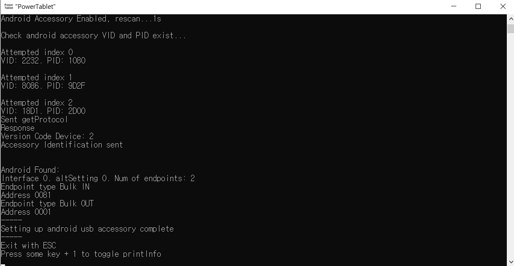

# PowerTablet USB method Manual
**This is not ADB method**

---
## Other languages
* [한국어](https://github.com/Lumy0726/PowerTabletManual/blob/main/USB_manual_kr.md/)
---
  
Installing WinUSB driver is required for PowerTablet to use USB connection method.  
You have to install driver twice, and mistakes while installing driver may cause other device problem, so be careful.

---
# Download Zadig  
Zadig is the program which help you install WinUSB driver.  
You can download Zadig at official website.  
[https://zadig.akeo.ie/](https://zadig.akeo.ie/)  
  
Click 'Zadig 2.5(4.9MB)' to start download.

---
# Install first WinUSB driver
If you connect android device to your PC, then you can see option in android notification.  
  
In this picture, you can see the device supports four connection methods. In order to use PowerTablet USB connection method, you have to Install WinUSB driver at the one of the android connection type. This means that, you cannot use specific one method of the android connection type at which you install WinUSB. For example, if you install WinUSB driver at 'Transferring files', you cannot use 'Transferring files', unless uninstall WinUSB driver. Therefore it is recommended to install WinUSB driver at android connection type which you don't use. MIDI connection is generally recommended, if you don't use it.  
* Connect your android device using the type you want, then execute zadig program.
* Check 'List All dDevices' at 'Options' tab.  
  
* Select your android device.  
    
  In this picture, there is already installed driver called 'dg_ssudbus'. To the right of that, **select 'WinUSB'** and click 'Replace Driver'.  
  **If you select wrong device, Zadig will replace driver of that device, so be careful.**  
  If that happened, in most case, you can repair problem by uninstalling wrong WinUSB driver. Check the last part of this manual for more detail.
* If installing is completed, you can see WinUSB driver in Zadig when you connect android device again with selected connection type, like this.  
    
  (Unlike this pictures, PID and VID (04E8, 686C in the pic) should be same. PID and VID is changed by connection type.)

---
# Install second WinUSB driver
If you installed first WinUSB driver, then connect android device using selected type, run PowerTablet.exe and press 'U' key at the first menu.  
If the first WinUSB driver works well, your android device turns into accessory mode like below picture.  
  
But you need to install second WinUSB driver. This means that you can't use PowerTablet USB method in this state. Just quit PowerTablet.exe and do not disconnect android device.  
* Install second WinUSB driver while connection type is android accessory mode.  
  Installing process is same to the first, the only difference is that connection type is android accessory mode. In Zadig, select android device and install WinUSB driver.

---
# Setup connection
If the WinUSB driver installed well, connection is pretty easy. Connect your android device with selected connection type, and run PowerTablet.exe and press 'U' key at first menu.  
  
If everything is going well, PC program says 'Settings up android usb accessory complete'. Then Press 'USB' button at android PowerTablet. Then PC program says 'Successfully applied settings', which means that connection is fully completed.  
In addition, if you have multiple android device (different model) and use all of them, then you have to install WinUSB driver for each device. This means that if you install WinUSB driver at a device which you don't use, your main device which you use has no problem with general connection type.

---
# Uninstall WinUSB driver
If you want to use general connection again or want to remove wrong installed driver, you can just remove WinUSB driver.  
Generally Windows does not remove previous driver when installing new driver. Therefore removing WinUSB driver makes previous driver active.  
To uninstall WinUSB driver, run Windows Device Manager. Then check 'Show hidden devices' in 'View' tab. WinUSB drivers (devices) are in 'Universal Serial Bus devices'. Then you can double click device (driver), uninstall it. The 'Driver Provider' of which install with Zadig is 'libwdi', in 'Driver' tab. Be sure to uninstall 'WinUSB' driver this way.
