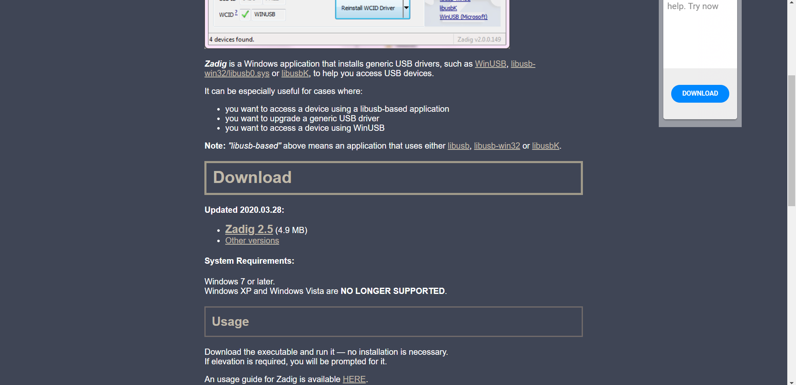
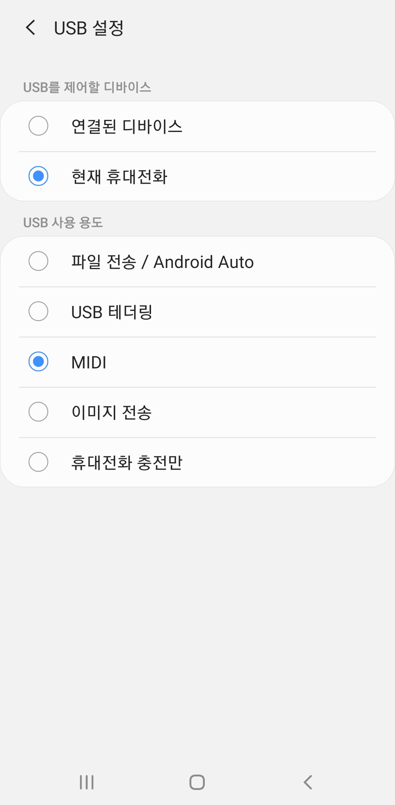
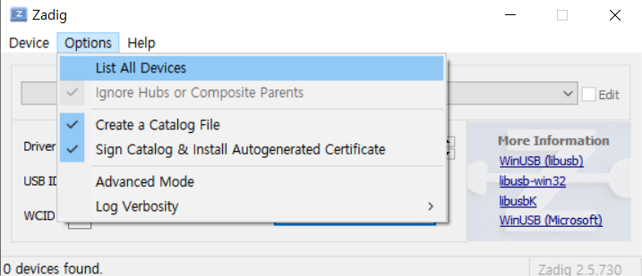
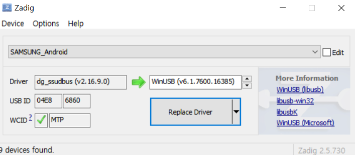
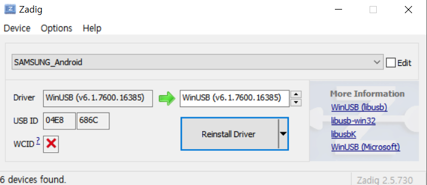
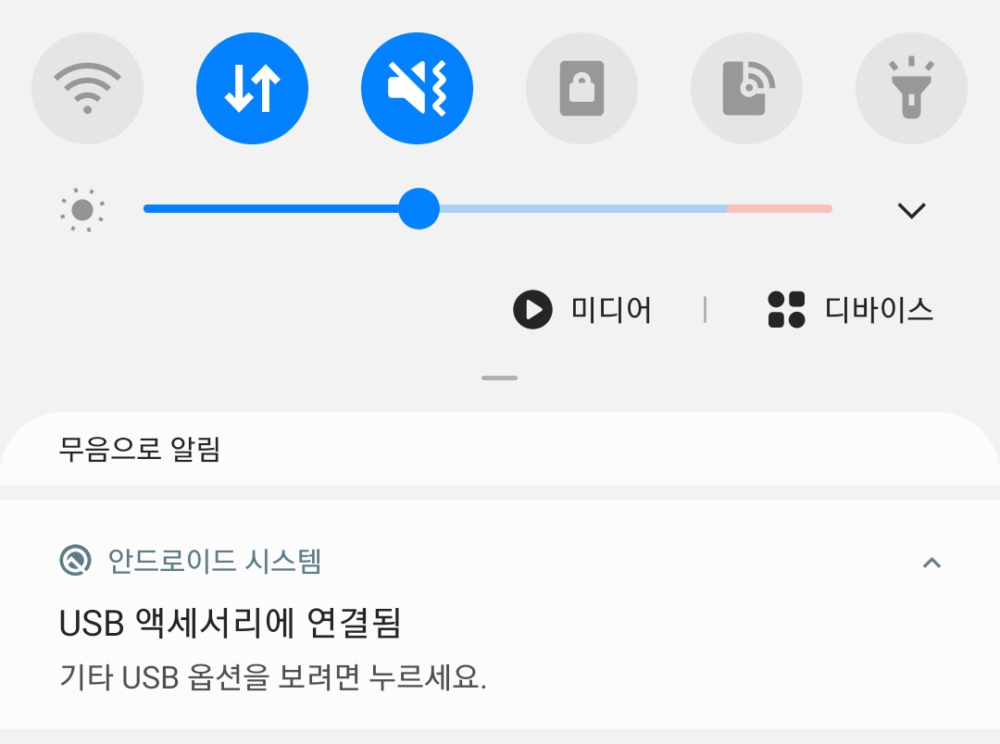
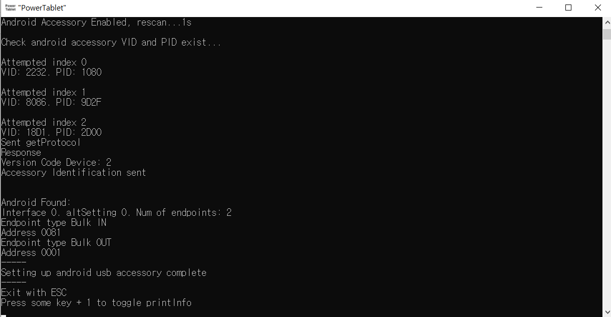

# PowerTablet USB method Manual
**ADB 방식에 대한 메뉴얼이 아닙니다**

---
## Other languages
* [english](https://github.com/Lumy0726/PowerTabletManual/blob/main/USB_manual.md/)
---
  
PowerTablet 프로그램이 USB연결을 사용할 수 있도록 하려면 WinUSB드라이버 설치가 필요합니다.  
드라이버를 두 번 설치해야 하고 드라이버 설치 과정에서 실수하면 컴퓨터에 문제를 야기할 수도 있으므로 조심하기 바랍니다.  

---
# Zadig 다운로드
WinUSB 드라이버를 쉽게 설치할 수 있도록 해 주는 프로그램입니다.  
Zadig 공식 홈페이지에 들어가면 다운받을 수 있습니다.  
[https://zadig.akeo.ie/](https://zadig.akeo.ie/)  
  
가운데에 Zadig 2.5(4.9MB)를 클릭하면 됩니다.

---
# 첫 번째 WinUSB 드라이버 설치
안드로이드를 PC에 연결하면 안드로이드에 알림창이 뜨고 거기서 연결 옵션을 변경할 수 있을 것입니다. 다음은 연결 옵션의 예시입니다.  
  
현재 사진에서는 4가지 연결 방식을 지원하는 것을 알 수 있습니다. PowerTablet의 USB연결 방식을 사용하기 위해서는 이 연결 방식 중 하나에 WinUSB를 설치하여야 합니다. 그 뜻은 WinUSB를 설치한 연결 방식은 WinUSB를 삭제하기 전까지는 PowerTablet을 제외하고는 사용이 불가능합니다. 예를 들어 파일 전송 옵션에 WinUSB를 설치하면 지금까지 사용하던 파일 전송 기능을 사용할 수 없습니다. 따라서 연결 방식 중 사용하지 않는 하나의 방식을 선택해 주세요. 보통 잘 쓰지 않는 MIDI연결을 사용하는 것을 추천합니다.  
* 원하는 방식으로 안드로이드 기기를 PC에 연결한 뒤 Zadig 프로그램을 실행합니다.
* Options에서 List All Device를 체크합니다.  
  
* 연결한 안드로이드 기기를 선택합니다.  
    
  현재 사진상에서는 dg_ssudbus라는 드라이버가 설치되어 있습니다. 그 오른쪽에서 **WinUSB를** 선택한 뒤 하단의 Relpace Driver버튼을 누릅니다.  
  **잘못된 항목을 선택할 경우 해당 드라이버를 덮어쓰게 되므로 주의해주세요.**  
  해당 일이 일어났을 경우에는 장치 관리자에서 설치한 WinUSB드라이버를 삭제하면 대부분은 해결됩니다. 메뉴얼의 마지막 부분을 참고하세요.
* 정상적으로 설치된 후 다시 안드로이드를 해당 방식으로 연결한 뒤 Zadig를 보면 WinUSB가 설치된 것을 사진처럼 확인할 수 있습니다.  
    
  (사진과는 달리 USB ID에 표시된 PID, VID는 동일합니다 (사진에서 04E8, 686C). PID, VID는 안드로이드에서 선택한 연결 방식에 따라 달라집니다.)

---
# 두 번째 WinUSB 드라이버 설치
첫번째 드라이버 설치에 성공하였다면 해당 방식으로 안드로이드를 PC에 연결한 뒤, PowerTablet.exe 를 실행하여 U버튼을 눌러 USB로 연결을 시도합니다.  
이 때 안드로이드가 다음과 같이 Accessory모드로 변경되어야 첫번째 드라이버 설치가 완료된 것입니다.  
  
하지만 두 번쨰 WinUSB 드라이버를 설치해야 합니다. 즉 이 상태에서는 PowerTablet의 USB 연결 방식을 사용할 수 없습니다. PowerTablet.exe를 종료하고 안드로이드는 연결한 상태를 유지해 주세요.  
* 안드로이드가 Accessory 모드로 연결된 상태에서 WinUSB 드라이버를 설치합니다.  
  연결 방식이 Accessory 모드인 점을 제외하고는 설치 과정은 첫 번째와 동일합니다. Zadig 프로그램에서 안드로이드 기기를 선택하고 WinUSB를 설치해 주세요.

---
# 최종 연결
드라이버 설치가 모두 완료되었다면, 연결하는 방법은 어렵지 않습니다.  
처음 안드로이드를 PC에 연결한 뒤 WinUSB를 설치한 연결 방식으로 전환한 뒤, PC에서 PowerTablet.exe를 실행한 뒤 U버튼을 눌러 USB모드로 연결하면 됩니다.  
  
최종적으로 PC에서 연결이 완료되었다면 마지막 부근에 Setting up android usb accessory complete라는 문구가 나타날 것입니다. 그 후 안드로이드 PowerTablet 앱에서 USB버튼을 선택하면 안드로이드와 PC가 완벽히 연결될 것입니다. WIFI를 연결하였을 때처럼, 앱에서는 USB ON이 뜨고, PC에서는 Successfully applied settings 문구가 뜬다면 연결에 성공한 것입니다.  
참고로, 안드로이드 기기가 여러 개인 경우, 기기 기종이 다르다면 WinUSB드라이버 설치는 각각의 기기마다 이루어져야 합니다. 따라서 안 쓰는 안드로이드 기기의 연결에 WinUSB를 설치하면, 다른 기기는 일반적인 용도로 연결하여 사용하는 데에 지장이 없습니다.

---
# WinUSB 드라이버의 삭제
일반적인 연결 방식을 다시 사용하기 원하거나 잘못 설치한 드라이버를 제거하기 위해서는, WinUSB 드라이버를 제거하는 것으로 충분합니다.  
윈도우는 새로운 드라이버를 설치할 때 기존의 드라이버를 완전히 삭제하지 않습니다. 따라서 WinUSB 드라이버를 지우는 것만으로 이전에 사용하던 드라이버를 활성화할 수 있습니다.  
PC의 장치 관리자 프로그램을 실행한 뒤, '보기-숨겨진 장치 표시'를 체크합니다. WinUSB는 '범용 직렬 버스 장치' 종류에 설치되어 있습니다. 그 안에서 해당 드라이버를 찾아 삭제하면 됩니다. Zadig로 설치한 드라이버는 우클릭하여 속성을 클릭한 뒤 '드라이버' 탭을 클릭하면 드라이버 공급자가 libwdi로 되어 있으니 참고하시기 바랍니다.
